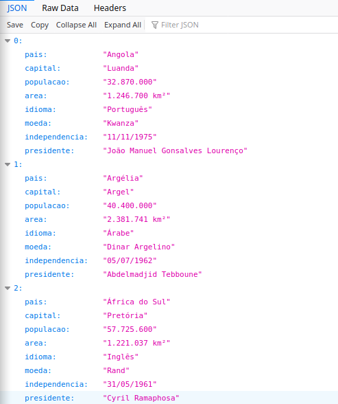
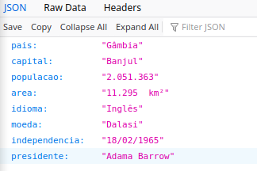

## Esta é uma  pequena API para obtenção de algumas informações básicas de países africanos. 

## Informações possíveis:
* O nome do País
* A capital do País
* O presidente actual
* A data da independência
* A densidade populacional
* A área geográfica
* O idioma oficial
* A moeda local
* etc
##

##  Detalhes do Projecto

### Ferramentas de Desenvolvimento utilizadas:
* PHP 7
* Padrão de Desenvolvimento MVC
##

## Retorno da Informações
* As informações são retornadas no formato json
##

## Rotas da API:
* URL/       => esta é a rota base que retorna todos os paises

    Ex: rota: https://africacountries.herokuapp.com//
         
        retorno: 
        

 

* URL/{pais} => esta é a rota que retorna um pais especificado no parametro {pais}.

    Ex: rota: https://africacountries.herokuapp.com/gâmbia
         
        retorno: 
        
##

## Link actual para as rotas.

    URL = https://africacountries.herokuapp.com/